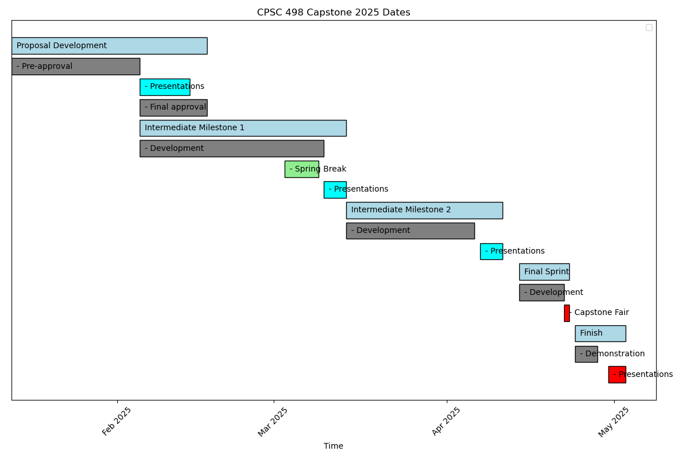

# Capstone Proposal Development

This project is to be used as you track progress toward acceptance
of your CPSC 498 Capstone Proposal.

After acceptance, you are expected to create a *new project*
and use that for tracking development.

All of your work for your capstone should be tracked in this private GitLab repo.
You are permitted/encouraged to create a public repo in the future based on your final project, but only work tracked in this new `student-gitlab.pcs.cnu.edu` repo will be graded.

You may treat this proposal project as a sandbox to explore code, but
mainly it will be used for tracking issues and milestones via
the GitLab web interface.

Feel free to use this README or add other markdown (*.md) files to
track your ideas or store links to references online if you wish.

Your proposal must be finalized and accepted no later than 4-February-26, with your
proposal presentation given no later than 13-February-26.

To start, we will first fork this project to your individual group.

Under this project we will start tracking "Milestones" and "Issues/Tasks".

Create seven milestones with the below descriptions and set start and end dates

 1. Team Formation

    Start 12-Jan-26
    End NLT  24-Jan-26

    Decide if you are working alone or in team with specific members.
    Up to 3 team members are allowed, but requires proportionally larger project

 2. Problem/Topic Selection

    Start 12-Jan-26
    End NLT  4-Feb-26

    You need to choose a topic area to focus on and choose a "problem" that you are going to solve using CS skills.

 3. Background Research

     Start 12-Jan-26
     End NLT 9-Feb-26

     What tools are available to help solve your problem?

     Are there similar projects you can learn from?

     How is your problem unique and is the uniqueness worthy of "capstone"?

     What do you need to learn to be successful?

     What is the preliminary task breakdown?

 4. Gantt Chart development

    Start 13-Jan-26
    End NLT 9-Feb-26

    You must prepare a [Gantt chart](https://www.officetimeline.com/gantt-chart) that you will update maintain throughout the semester.

    > Note: Link to https://www.officetimeline.com/gantt-chart description does NOT
    > imply endorsement of their tools.

    Your Gantt chart should show initial plan and progress toward objectives.
    You will update this as you go.

    You may use an online tool, create them by hand, or use Python.
    I have provided some example Python scripts in this repo, but you are welcome to use whatever
    tool you want to generate the Gantt chart.

    

 5. Preliminary Approval

    Start 12-Jan-26
    End NLT  4-Feb-26

    You need to discuss basic concept, goals, and tentative schedule with
    your professor prior to your official "Proposal Presentation"

 6. Proposal Presentation

    Start 26-Jan-26
    End NLT  13-Feb-26

    Formal, oral presentation with PowerPoint (or similar) visuals.
    In this presentation you must define problem, scope, resources,
    and most importantly define a schedule for achieving the project.

    Your peers and professor will rank project difficulty/reasonableness and
    scale the available points for your project based on this presentation.

    You will receive final project approval after this presentation.

 7. Project Approval

    Start 26-Jan-26
    End NLT  16-Feb-26

    Professor has approved project and work proceeds in a new GitLab project for tracking

> Note: You are required to use the GitLab Milestones and Issues for this proposal development stage.
> For your project planning and management of your capstone, you are welcome to use this or
> any formal task planning software.
> One popular modern approach is a "Kanban" board.  There are several online tools that provide a free
> basic functionality.  See https://monday.com, https://trello.com, https://kanbanflow.com/ or
> one of your choice.  You must research and learn this on your own, and present the
> task plan as part of your proposal presentation. See [Kanban](docs/kanban.md) for more information.

*Regardless* of the *tool* you use to do task planning, you are *required* to use task planning
throughout the project.

Under each Milestone, you will create "Issues" to track tasks you need to do to manage project,
or software features to write, or "bugs" to fix.

For first issue, create a "Meet my classmates" issue under Milestone 1
that starts 12-Jan-26 and ends 21-Jan-26.  Assign that task to yourself.

Under `Background Research` create an issue to "Read Scrum guidelines" as linked on Scholar.
This task is due 20-Jan-26.

You must create at least one issue for each milestone.
An issue should present a task from 15 minutes to 4 hours of effort, with a 1/2 hour being reasonable.
Each issue should be assigned to the primary person responsible for seeing it is completed.

You are expected to track all of your time spent on the capstone.  
Either by adding comments to relevant issue up until it is complete and closed, or
under whatever task planning tool you choose.

You will give weekly reports on your efforts and progress based on the effort tracked in these issues.  
Update the comments each time you work on a task, even if you are not finished.  
If you don't have a comment for a particular day, you weren't working on capstone.

> NOTE: Issues are for tracking work.  Git "commits" are for tracking changes to files.   
> So you only commit when you change a file (e.g. add a note to this README or add new markdown file),
> but you should track progress on issues even if time was just spent researching on web.

Add links to relevant web searches and other helpful information as you go on the issue comments.

You may also make use of the project "wiki" to document your design efforts as you go, and track ideas.

These issue comments will serve as your "log book" for CPSC 498.

Your weekly progress grade is based on your oral presentation in class and these issue comments.  
Progress should be documented at regular intervals, and not "day of" status report.
You should work to get every point for the status updates, but that will require deligence.

Track your work on this "proposal" project up until you get final approval.  
Wait until you've gotten Preliminary approval before you create a separate project
for your capstone project, but you can use both after preliminary approval.

After your proposal is accepted, you will be responsible for defining and tracking
all issues and milestones in a separate "capstone project" repository (you choose a relevant name),
but you will surely want to include the "Intermediate Progress Presentation" milestones,
as well as the final demonstrations as milestones.

Your "Milestones" should represent about 1 to 2 weeks of effort each, and should
typically correspond to significant progress points, including but not limited
to the required in-class presentations.  
This will be your official "log book" of your work on the project.  
Each Milestone will have multiple issues assigned to track tasks.

For a team project, there will be one "owner" of the project, and
everyone else will be added as "maintainers" on that project.
Each issue should be assigned to a single team member, so break the tasks
accordingly even if collaborating on a task.  
That team member should be primarily responsible for updates to the issue,
but teammates can comment as needed.

These "Issues" and documented comments will be one of the means used to
assess individual contributions to the project.
Significant coding efforts should be noted with a link to the commit,
and commits should be made by the individual doing the coding.
If working in a "pair programming" model, then note that in both commit message
and comments on Issue; switch driver/navigator roles often.

As this is a computer science capstone, all team members should be making
significant contributions to the coding efforts even if not strictly equal.
Some members may devote more time to other non-coding tasks (e.g. documentation/testing),
but must contribute to code, and must know the entire codebase used in project.  
For non-coding tasks, make sure your time is documented in Issues.
This includes time doing background research on Google, but not Instagram/Snapchat time :-)

Your week 2 stand up status report is based on completing this pre-proposal planning.
A single slide or `png` image file showing a screen shot of your milestones and issues is required.
I expect these milestones to be created and "Scrum guidelines" read before Wednesday 21-Jan-26,
and are expected to be part of your first stand up status meeting.
